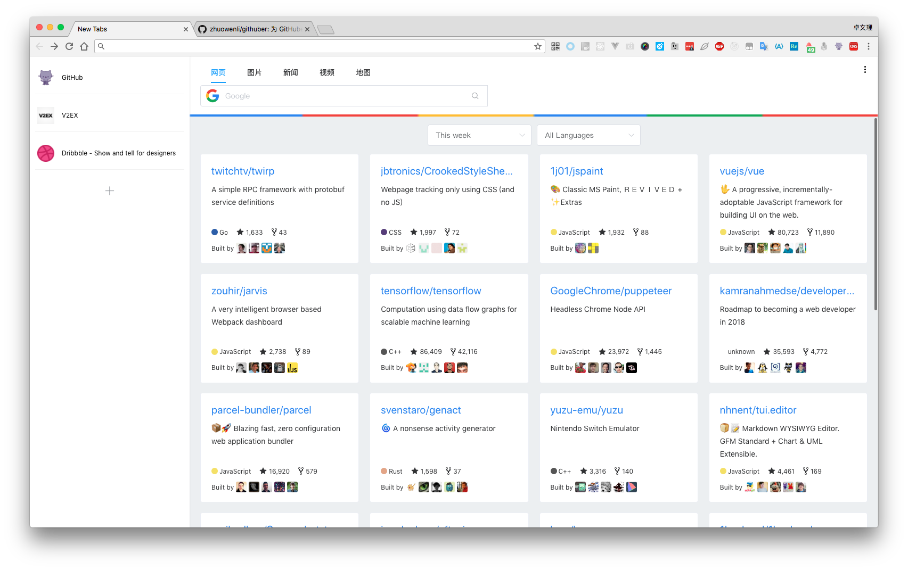

# githuber

这是一个帮助 Githuber 每日发现优质内容的 Chrome 主页拓展。



## 本地开发

```bash
# 安装依赖
yarn

# 开发环境
yarn dev
```

打开 localhost:4000 访问页面。

## chrome 插件开发模式

1. 编译代码
```
# 执行 watch 命令
yarn watch
```

2. 打开 Chrome [扩展程序](chrome://extensions/)，开启开发者模式
3. 点击**加载已解压的扩展程序**，找到编译输出的 `dist` 目录，加载代码


> 本地开发需要安装扩展程序 [Allow-Control-Allow-Origin: *](https://chrome.google.com/webstore/detail/allow-control-allow-origi/nlfbmbojpeacfghkpbjhddihlkkiljbi)，解决开发时的 CORS 跨域问题

## 服务器部署

1. 添加配置文件

```bash
# 添加 .env 填写正确的配置信息
cp .env.example .env
```

2. 创建数据库（默认用MySQL）

```bash
# 初始化数据表
yarn db:migrate
```

3. 启动服务

```bash
# 开发环境
yarn nodemon

# 生产环境
yarn start
```


## TODO LIST

- [x] 搜索引擎
    - Google
    - Baidu
    - Bing
    - Yahoo
    - 附加搜索引擎（用%s代替查询参数）
    - 搜索联想
- [x] 内容推荐
    - GitHub Discover repositories
    - GitHub Trending (data range：Today、This week、This month，language range)
- [ ] 其他平台（待定）
        - v2ex
        - Dribbble
        - Behance
        - 500px
        - unsplash
        - producthunt
- [x] 设置
- [x] 弹窗
    - 书签收藏（快捷入口）
    - 读取标题、logo、URL（可编辑）
    - 添加按钮
- [ ] i18n
    - 中文
    - 英文
- [ ] 高级设置（待定）
    - RSS
    - 自定义爬虫
- [ ] 数据同步
    - 手动备份到云端
    - 从云端恢复数据
    - 账号（登录，注册）
- [x] 书签收藏（快捷入口）
- [ ] 最常访问（待定）
- [ ] 服务端
    - [x] 框架搭建：koa/egg Sequelize
    - [ ] Trending 爬虫
    - [ ] GitHub 授权，根据用户ID获取 Discover（待定）
- [ ] 上架


## License
Githuber © [zhuowenli](https://github.com/zhuowenli), Released under the [Mozilla Public License 2.0](./LICENSE) License.
